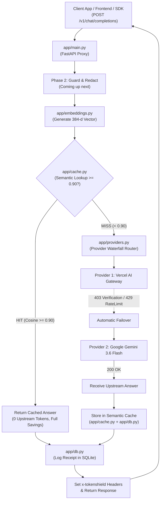

# TokenShield - Architecture & Phase 1 Explainer for Teammates

This document is a complete technical guide explaining **what TokenShield is, how every component works under the hood, and everything accomplished in Phase 1**. It is designed so any teammate joining the codebase can understand every file and contribute immediately.

---

## 1. What is TokenShield?

**TokenShield** is an intelligent, student-first local reverse proxy for Large Language Models (LLMs). Instead of sending queries directly to OpenAI, Anthropic, or Google, client applications send standard OpenAI-compatible requests to TokenShield at `http://127.0.0.1:8000/v1/chat/completions`.

### Core Goals:
1. **Save Token Spend via Semantic Caching**: Identical or semantically similar questions are intercepted and answered directly from a local SQLite database without calling an upstream provider or consuming API credits.
2. **Provider Waterfall & Failover**: If an upstream key is rate-limited (HTTP 429), hits an unpaid quota limit (HTTP 402), or requires verification (HTTP 403), TokenShield automatically fails over to secondary keys without breaking the user experience.
3. **Transparency & Receipts**: Every response includes detailed token headers and a persistent receipt showing exactly how many tokens were saved, which provider was used, and which optimization strategies were executed.

---

## 2. High-Level System Architecture



---

## 3. The Complete Request Lifecycle

When a client makes a `POST /v1/chat/completions` request:

1. **Request Ingestion**: `app/main.py` receives the request and generates a unique `request_id` (e.g. `req_abc123`).
2. **Token Estimation**: `app/tokens.py` calculates the raw token count of the incoming messages using `tiktoken` (or character heuristics).
3. **Embedding Generation**: `app/embeddings.py` embeds the latest user question into a 384-dimensional normalized vector.
4. **Cache Lookup**: `app/cache.py` compares this vector against all previously stored questions in SQLite using cosine similarity:
   - **If Similarity $\ge$ 0.90 (HIT)**: Returns the saved answer immediately. Upstream tokens = `0`, Saved tokens = `raw_input_tokens`, Provider = `"cache"`, Failover = `false`.
   - **If Similarity < 0.90 (MISS)**:
     - Dispatches request through `app/providers.py`.
     - Tries the primary provider. If it returns 402/403/429/5xx, it catches the error and tries the next provider in the waterfall.
     - Saves the newly received answer and embedding vector in SQLite for future queries.
5. **Receipt Persistence**: `app/db.py` inserts a record into the `request_logs` SQLite table.
6. **Headers & Delivery**: Response headers starting with `x-tokenshield-*` and an embedded `"tokenshield": receipt` JSON block are returned to the client.

---

## 4. File-by-File Technical Deep Dive

Here is an exact explanation of every file in the codebase, what it does, and why it exists.

### Root Files

#### `.env.local` (and `.env.example`)
- **Purpose**: Stores local environment variables and sensitive API keys.
- **Security Rule**: `.env.local` is ignored by `.gitignore`. Never hardcode or commit keys.
- **Active Keys in Our Setup**:
  - `GOOGLE_API_KEY`: Google Gemini API key (active with `gemini-3.6-flash`).
  - `OLLAMA_API_KEY`: Ollama Cloud API key (active with `gpt-oss:20b`).
  - `KILO_API_KEY`: Kilo AI Gateway JWT token (active with `openrouter/free`).
  - `COHERE_API_KEY`: Cohere API key (active for chat and dense embeddings).
  - `AI_GATEWAY_API_KEY`: Vercel AI Gateway key (awaiting card verification on Vercel).

#### `pyproject.toml` & `requirements.txt`
- **Purpose**: Python project dependencies (`fastapi`, `uvicorn`, `httpx`, `pytest`, `anyio`).

#### `package.json` & `index.ts`
- **Purpose**: Node.js/TypeScript example demonstrating how a frontend or Node client uses the Vercel AI SDK (`ai` package) with `generateText` targeting TokenShield or upstream gateways.

---

### Core Application: `app/`

#### `app/main.py` - The Proxy Gateway
The entry point of the FastAPI application.
- **Key Endpoints**:
  - `GET /health`: Returns service status, embedding backend in use, and configured providers.
  - `POST /embed`: Smoke-test endpoint to embed raw text and preview vector dimensions.
  - `GET /metrics/live`: Returns aggregate token metrics, cache hit rate, and total tokens saved across all requests.
  - `GET /receipt/{request_id}`: Fetches the stored audit receipt for a specific request.
  - `POST /v1/chat/completions`: The core OpenAI-compatible proxy route.
- **Key Helper Functions**:
  - `latest_user_text(messages)`: Extracts the most recent question asked by the user from the chat history.
  - `set_tokenshield_headers(response, receipt)`: Stamps all 7 custom headers on the HTTP response.
  - `cached_chat_response(request, answer, receipt)`: Formats a cache HIT into an authentic OpenAI chat completion JSON response.

#### `app/db.py` - SQLite Persistence
Manages the local SQLite database (`.tokenshield/tokenshield.sqlite3`).
- **Tables**:
  1. `cache_entries`: Stores `(id, question, answer, vector_json, model, provider, hit_count, created_at)`.
  2. `request_logs`: Stores every transaction: `(request_id, session_id, provider, model, cache_hit, raw_input_tokens, optimized_input_tokens, upstream_input_tokens, output_tokens, saved_tokens, strategies_json, failover_used, created_at)`.
- **Key Methods**:
  - `_ensure_request_log_columns()`: Automatically checks schema with `pragma table_info` and alters tables if columns are missing (safe auto-migration).
  - `insert_cache_entry(...)`: Serializes float vectors to JSON and inserts new Q&A pairs.
  - `mark_cache_hit(entry_id)`: Increments the `hit_count` for analytics.
  - `get_receipt(request_id)`: Retrieves the receipt record by unique request ID, deserializing the JSON strategies list.
  - `metrics()`: Calculates aggregate queries, cache hit rate, and total saved tokens.

#### `app/cache.py` - Semantic Caching Engine
Determines whether an incoming prompt is semantically equivalent to an existing answer.
- `cosine_similarity(left, right)`: Computes the dot product of normalized vectors:
  $$\text{sim}(u, v) = \sum_{i} u_i \cdot v_i$$
- `SemanticCache.lookup(vector)`:
  Iterates through cached entries, computes cosine similarity against each vector, and finds the highest score. If the best score meets or exceeds `threshold` (default `0.90`), it returns a `CacheHit` object.
- `SemanticCache.store(...)`: Saves a new Q&A pair and vector to the database.

#### `app/embeddings.py` - Vector Embedding Generator
Converts plain text into mathematical vector representations.
- `HashEmbeddingService`: A dependency-free, fast 384-dimensional vectorizer. Tokenizes words, runs SHA-256 to hash them into coordinates, applies sign flipping, and normalizes to unit length ($||v||_2 = 1$). Perfect for local hackathon development without downloading massive gigabyte models.
- `SentenceTransformerEmbeddingService`: Optional ML-based backend using Hugging Face's `all-MiniLM-L6-v2` for production-grade semantic comprehension.
- `build_embedding_service(backend)`: Factory selecting the active embedding engine based on `TOKENSHIELD_EMBEDDING_BACKEND`.

#### `app/providers.py` - Waterfall Router & Failover
Handles communication with external LLM providers and failover resilience.
- `ProviderError`: Exception tracking which provider failed and its HTTP status code.
- `ProviderRouter.chat_completion(payload)`:
  - Loops sequentially through configured providers.
  - If a provider encounters a transient or quota error, it catches it and falls over to the next provider:
    ```python
    if error.status_code not in {402, 403, 408, 409, 425, 429, 500, 502, 503, 504}:
        raise
    ```
  - Specifically, **HTTP 402** (quota exceeded) and **HTTP 403** (card verification required) trigger automatic waterfall.
  - Returns the response, the winning provider config, and a boolean `used_failover` (`True` if it had to skip provider 1).

#### `app/config.py` - Application Settings
Loads configuration from environment variables or numbered keys:
- `load_dotenv_local()`: Reads `.env.local` safely without overwriting already set system environment variables.
- `default_provider_configs()`: Builds the prioritized fallback list:
  1. **Vercel** (`openai/gpt-5.5`)
  2. **Google** (`gemini-3.6-flash`)
  3. **Ollama Cloud** (`gpt-oss:20b`)
  4. **Kilo AI Gateway** (`openrouter/free`)
  5. **Groq** (`llama-3.1-8b-instant`)
- Supports numbered configurations (`TOKENSHIELD_PROVIDER_1_*`, etc.) for users with up to 20 custom fallback keys.

#### `app/tokens.py` - Token Estimator
Calculates prompt size:
- Uses `tiktoken` with `o200k_base` if installed.
- Uses character length fallback heuristic (`len(text) // 4`) if `tiktoken` is unavailable.

---

### Test Suite: `tests/`

- `tests/test_receipt.py`:
  - Validates all 7 headers exist on both cache MISS and cache HIT.
  - Verifies `/receipt/{request_id}` returns the logged receipt.
  - Verifies 402 and 403 status codes trigger waterfall failover.
- `tests/test_cache.py`: Tests hash embedding dimensionality (384) and verifies identical questions have `1.0` cosine similarity.
- `tests/test_chat_cache.py`: Tests the `/v1/chat/completions` route end-to-end with mocks, ensuring call 1 is a MISS and call 2 is a HIT with 0 upstream calls.
- `tests/test_config.py`: Tests numbered provider configurations.
- `tests/test_health.py`: Tests `/health` and `/embed` endpoints.
- `tests/test_providers.py`: Unit tests for router failover behavior.

---

## 5. API Headers & Receipts Reference

### Response Headers
Every response returned by TokenShield includes:

| Header Name | Value Example | Meaning |
| :--- | :--- | :--- |
| `x-tokenshield-request-id` | `c778852a92324...` | Unique tracking ID for the transaction |
| `x-tokenshield-cache` | `HIT` or `MISS` | Whether answer came from local cache or upstream |
| `x-tokenshield-provider` | `google` / `cache` | Name of the provider that answered |
| `x-tokenshield-failover` | `true` or `false` | Whether upstream had to fall back to a backup key |
| `x-tokenshield-raw-input-tokens` | `45` | Tokens in the original client prompt |
| `x-tokenshield-optimized-input-tokens` | `45` | Tokens after redaction/shrinking (Phase 2 & 3) |
| `x-tokenshield-upstream-input-tokens` | `0` (on HIT) | Actual tokens billed by external provider |
| `x-tokenshield-saved-input-tokens` | `45` (on HIT) | Tokens saved on this request |
| `x-tokenshield-strategies` | `provider_proxy,provider_waterfall` | List of optimizations that executed |

### JSON Response Receipt Object
Inside the standard OpenAI response JSON, a `"tokenshield"` block is included:
```json
{
  "id": "chatcmpl-...",
  "object": "chat.completion",
  "choices": [
    {
      "message": {
        "role": "assistant",
        "content": "7"
      }
    }
  ],
  "tokenshield": {
    "request_id": "c778852a92324664a205c473b9c351ea",
    "cache": "MISS",
    "provider": "google",
    "model": "gemini-3.6-flash",
    "failover": true,
    "raw_input_tokens": 13,
    "optimized_input_tokens": 13,
    "upstream_input_tokens": 13,
    "saved_input_tokens": 0,
    "output_tokens": 1,
    "strategies": [
      "provider_proxy",
      "provider_waterfall"
    ]
  }
}
```

---

## 6. How to Run & Verify

### Run Automated Tests
```powershell
python -m pytest -p no:cacheprovider --basetemp=.tokenshield/pytest_temp
```
*(All 12 tests pass.)*

### Start the Server Locally
```powershell
python -m uvicorn app.main:app --reload --port 8000
```

### Health Check
```powershell
Invoke-RestMethod http://127.0.0.1:8000/health
```

### Send a Test Chat Prompt
```powershell
Invoke-RestMethod http://127.0.0.1:8000/v1/chat/completions `
  -Method Post `
  -ContentType "application/json" `
  -Headers @{"x-tokenshield-session"="demo"} `
  -Body '{"messages":[{"role":"user","content":"What is binary search?"}]}'
```

### View Live Token Savings
```powershell
Invoke-RestMethod http://127.0.0.1:8000/metrics/live
```

---

## 7. What's Next: Phase 2 ("Guard Mode")

Now that the proxy core is locked and tested:
- **Phase 2 Goal**: Detect and redact accidental student secrets (API keys, bearer tokens, JWTs, emails, phone numbers) before prompts are ever sent to an upstream provider or stored in SQLite.
- **Touches**: Create `app/guard.py`, integrate into `app/main.py`, and add `tests/test_guard.py`.
