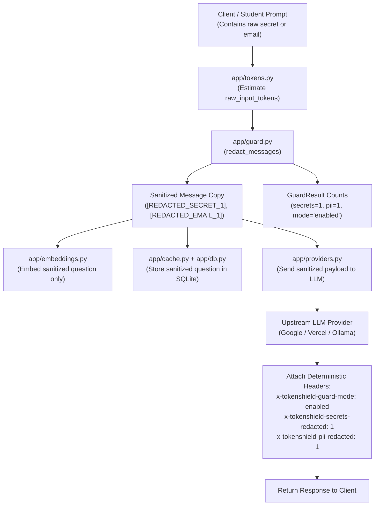

# TokenShield - Phase 2: Guard Mode Technical Guide

This document provides a complete technical explanation of **Phase 2: Guard Mode** in TokenShield. It is designed for teammates and judges to understand how student privacy is protected, how secrets are intercepted, and how token bloat is reduced before prompts ever reach an upstream model or local cache.

---

## 1. Overview & Motivation

Students frequently copy-paste code snippets, configuration files, and terminal outputs into AI chat interfaces. In doing so, they often accidentally expose:
- Live API keys (OpenAI, Vercel, GitHub, Google, AWS).
- Authentication tokens (JWTs, Bearer tokens).
- Personal Identifiable Information (PII), such as personal/school emails and phone numbers.

### Guard Mode Mission:
**Guard Mode** automatically intercepts and redacts sensitive credentials and PII **before prompts are cached, embedded, logged, or forwarded upstream**.

---

## 2. Guard Mode Lifecycle & Flow



---

## 3. Redaction Engine: `app/guard.py`

Located in [app/guard.py](file:///c:/token-shield/app/guard.py), the engine uses high-precision regular expressions to identify and replace sensitive data with clean, numbered placeholders.

### Detected Secret Types & Formats:
| Credential Type | Regex Pattern Pattern | Example Detected | Replacement |
| :--- | :--- | :--- | :--- |
| **OpenAI Keys** | `\bsk-(?:proj-)?[A-Za-z0-9-_]{20,}\b` | `sk-proj-abc123...` | `[REDACTED_SECRET_1]` |
| **Vercel AI Keys** | `\bvck_[A-Za-z0-9_]{25,}\b` | `vck_1tUT5x...` | `[REDACTED_SECRET_2]` |
| **GitHub Tokens** | `\bgh[pousr]_[A-Za-z0-9_]{30,}\b` | `ghp_abc123...` | `[REDACTED_SECRET_3]` |
| **JWT Tokens** | `\beyJ[A-Za-z0-9-_]+\.[A-Za-z0-9-_]+\.[A-Za-z0-9-_]+\b` | `eyJhbGci...` | `[REDACTED_SECRET_4]` |
| **Bearer Tokens** | `\bBearer\s+[A-Za-z0-9\-_.~+/]{20,}\b` | `Bearer dGVzdA...` | `[REDACTED_SECRET_5]` |
| **Generic Key Assignments** | `(?i)\b(?:api[_-]?key\|secret\|token)\s*[:=]\s*['"]?([A-Za-z0-9-_]{16,})['"]?` | `api_key = "abc12345..."` | `api_key = [REDACTED_SECRET_6]` |

### Detected PII Types:
| PII Type | Regex Pattern | Example Detected | Replacement |
| :--- | :--- | :--- | :--- |
| **Email Addresses** | `\b[A-Za-z0-9._%+-]+@[A-Za-z0-9.-]+\.[A-Za-z]{2,}\b` | `student@harvard.edu` | `[REDACTED_EMAIL_1]` |
| **Phone Numbers** | `(?:\+?\d{1,3}[-.\s]?)?\(?\d{3}\)?[-.\s]?\d{3}[-.\s]?\d{4}\b` | `+1-555-867-5309` | `[REDACTED_PHONE_1]` |

---

## 4. Multi-Format & Immutability Guarantees

In modern LLM applications (such as OpenAI SDK and Vercel AI SDK), message contents can take multiple structures:

### Supported Message Content Formats:
1. **Plain String Content**:
   ```json
   {"role": "user", "content": "My key is sk-123..."}
   ```
2. **Multi-Part Content Array**:
   ```json
   {
     "role": "user",
     "content": [
       {"type": "text", "text": "My key is sk-123..."},
       {"type": "image_url", "image_url": {"url": "https://example.com/pic.png"}}
     ]
   }
   ```

### Immutability Protection:
`redact_messages()` creates an isolated, deep copy of the message array. The incoming FastAPI request object is **never mutated**, ensuring other middleware or logging systems do not experience unexpected side effects.

---

## 5. The Triple Safety Guarantee

To ensure zero risk of credential leakage, TokenShield enforces a **Triple Safety Guarantee** verified by automated integration tests:

1. **Safety Layer 1 (Upstream Interception)**:
   In [app/main.py](file:///c:/token-shield/app/main.py), before dispatching to the provider router:
   ```python
   payload = request.model_dump(exclude_none=True)
   payload["messages"] = redacted_messages  # CRITICAL: Replaces raw messages
   upstream_response, provider, used_failover = await providers.chat_completion(payload)
   ```
   The external LLM (e.g. OpenAI, Google Gemini, Ollama) **never receives the secret string**.

2. **Safety Layer 2 (Cache & Vector Isolation)**:
   Embeddings and semantic cache entries are computed **strictly from the redacted text**:
   ```python
   question = latest_user_text(redacted_messages)
   vector = embeddings.embed_text(question)
   semantic_cache.store(question=question, ...)
   ```
   SQLite's `cache_entries` table never stores a raw secret.

3. **Safety Layer 3 (Audit Log Safety)**:
   The `request_logs` table in SQLite stores token metrics and counts (`secrets_redacted`, `pii_redacted`), **never the raw prompt text**.

---

## 6. Response Headers & Receipts API Contract

### Deterministic Response Headers
For frontend consistency, these headers **always exist on every response** (even when 0 redactions occur), so client dashboards never have to guess:

| Header Name | Clean Prompt Example | Redacted Prompt Example | Meaning |
| :--- | :--- | :--- | :--- |
| `x-tokenshield-guard-mode` | `enabled` | `enabled` | Shows Guard Mode is actively running |
| `x-tokenshield-secrets-redacted` | `0` | `1` | Count of secrets intercepted |
| `x-tokenshield-pii-redacted` | `0` | `1` | Count of personal data blocks intercepted |
| `x-tokenshield-saved-input-tokens`| `0` | `9` | Tokens saved by stripping long keys/hashes |
| `x-tokenshield-strategies` | `guard_mode,provider_proxy` | `guard_mode,secret_redaction,pii_redaction,provider_proxy` | Optimization strategies applied |

### Strategy Naming Convention:
- `guard_mode`: Always present (confirms Guard Mode inspected the prompt).
- `secret_redaction`: Appended only when `secrets_redacted > 0`.
- `pii_redaction`: Appended only when `pii_redacted > 0`.

---

## 7. Token Accounting Rules

Guard Mode also provides instant token savings by replacing long 60-character secret hashes with concise tokens (e.g. `[REDACTED_SECRET_1]`):

$$\text{raw\_input\_tokens} = \text{tokens in original client prompt}$$
$$\text{optimized\_input\_tokens} = \text{tokens in post-redaction prompt}$$
$$\text{saved\_input\_tokens} = \max(0, \text{raw\_input\_tokens} - \text{optimized\_input\_tokens})$$

---

## 8. Verification & Test Evidence

### Automated Test Suite
Run the full test suite via pytest:
```powershell
python -m pytest -p no:cacheprovider --basetemp=.tokenshield/pytest_temp
```
**Results: 16 passed in ~1.5s**, including:
- [tests/test_guard.py](file:///c:/token-shield/tests/test_guard.py):
  - `test_guard_unit_redaction_secrets_and_pii`: Validates regex detection and placeholder counts.
  - `test_guard_unit_supports_multipart_and_immutability`: Validates OpenAI multi-part text arrays and checks that original message objects are unmutated.
  - `test_guard_integration_triple_safety_and_headers`: Asserts upstream provider, SQLite cache entries, and receipts contain zero raw secrets.
  - `test_guard_clean_prompt_headers_and_strategies`: Asserts clean prompts output `secrets_redacted: 0` without false positives.

### Live PowerShell Manual Verification
```powershell
$res = Invoke-WebRequest http://127.0.0.1:8000/v1/chat/completions -UseBasicParsing `
  -Method Post `
  -ContentType "application/json" `
  -Body '{"messages":[{"role":"user","content":"My secret is sk-proj-1234567890abcdef1234567890 and email is student@harvard.edu. How do I secure it in 1 sentence?"}]}'

$res.Headers["x-tokenshield-guard-mode"]        # enabled
$res.Headers["x-tokenshield-secrets-redacted"]  # 1
$res.Headers["x-tokenshield-pii-redacted"]      # 1
$res.Headers["x-tokenshield-saved-input-tokens"] # 4
```

**Real LLM Output:**
> *"Store your secret in an encrypted password or secrets manager and protect your email account using a strong, unique password combined with multi-factor authentication (MFA)."*
