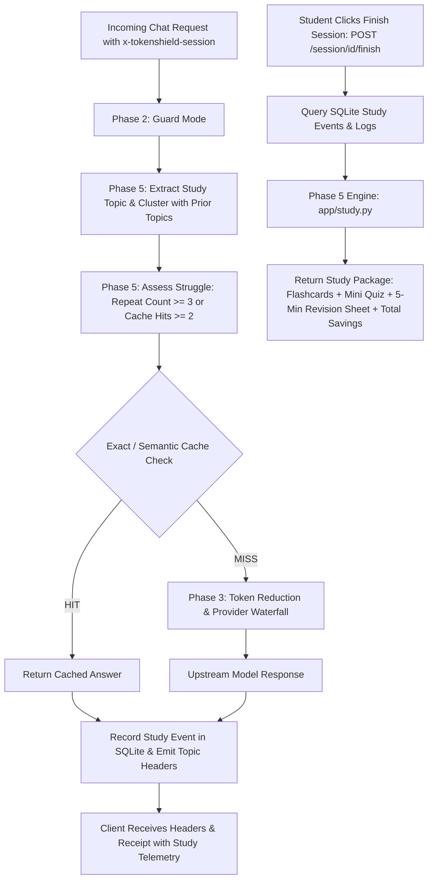

# Phase 5: Student Memory + Study Mode

## 1. Executive Summary

Up through Phase 4, TokenShield acted as a high-performance, cost-saving AI proxy:
- **Phase 1**: Proxy core, receipts, provider waterfall.
- **Phase 2**: Guard Mode (secrets & PII redaction).
- **Phase 3**: Unique query token reduction (note deduplication, history shrinker, answer budget directives).
- **Phase 4**: Multi-tier exact ($O(1)$) and semantic caching.

**Phase 5 transforms TokenShield into an intelligent, student-first learning companion.**
Instead of treating user requests as disconnected API calls, TokenShield tracks **what the student is studying**, detects when they are **struggling** with a concept, and generates an automated **personalized study package** (flashcards, mini quiz, and revision sheet) at the end of each session.

---

## 2. Architecture & Pipeline



---

## 3. Core Capabilities

### 3.1 Automatic Topic Tracking & Concept Clustering (`app/study.py`)
Questions asked in a session are analyzed to extract canonical topic terms:
- Common prompt phrasing (*"What is..."*, *"Why is..."*, *"Can you explain..."*, *"How does..."*) and filler words are stripped.
- New questions are dynamically clustered against existing topics in the session. For example:
  - `"What is binary search?"` $\rightarrow$ topic: `binary search`
  - `"binary search time complexity"` $\rightarrow$ clustered into: `binary search`
  - `"Why is binary search log n?"` $\rightarrow$ clustered into: `binary search`

### 3.2 Struggle Detection Heuristics
A student is flagged as struggling with a topic if either condition is met:
1. **$\ge 3$ questions** in the same session belong to that topic (repeated conceptual difficulty).
2. **$\ge 2$ cache hits** occur on that topic (the student is repeatedly asking the same or rephrased question).

When detected:
- Header: `x-tokenshield-struggling-topic: <topic>`
- Header: `x-tokenshield-topic: <topic>`
- Receipt field:
  ```json
  "study": {
    "topic": "binary search",
    "struggling": true,
    "repeat_count": 3
  }
  ```

### 3.3 Study Persistence (`app/db.py`)
Recorded in the `study_events` SQLite table:
```sql
CREATE TABLE IF NOT EXISTS study_events (
    id INTEGER PRIMARY KEY AUTOINCREMENT,
    session_id TEXT NOT NULL,
    request_id TEXT NOT NULL,
    topic TEXT NOT NULL,
    question TEXT NOT NULL,
    answer TEXT NOT NULL,
    cache_hit INTEGER NOT NULL DEFAULT 0,
    cache_type TEXT NOT NULL DEFAULT 'MISS',
    created_at TEXT NOT NULL DEFAULT CURRENT_TIMESTAMP
);
CREATE INDEX IF NOT EXISTS idx_study_events_session ON study_events(session_id);
CREATE INDEX IF NOT EXISTS idx_study_events_topic ON study_events(session_id, topic);
```

### 3.4 Finish Session Endpoint (`POST /session/{session_id}/finish`)
Provides students with an immediate learning closure and review sheet:
- **Telemetry**: Total requests, tokens saved, secrets/PII protected, and cache hit rate.
- **Topics Covered**: Comprehensive list of concepts covered during the study session.
- **Weak Topics**: Concepts flagged by struggle detection.
- **Flashcards**: Front (question) and Back (key concept / takeaway).
- **Mini Quiz**: Active-recall questions based on the session's answers.
- **5-Minute Revision Sheet**: Markdown formatted review summary prioritizing weak topics.

---

## 4. Example Output: `POST /session/{session_id}/finish`

```json
{
  "session_id": "cs101-algorithms",
  "total_requests": 4,
  "total_saved_tokens": 850,
  "raw_input_tokens": 1200,
  "upstream_input_tokens": 350,
  "secrets_protected": 1,
  "pii_protected": 0,
  "cache_hits": 1,
  "cache_hit_rate": 0.25,
  "topics_covered": ["binary search", "quicksort"],
  "struggling_topics": ["binary search"],
  "flashcards": [
    {
      "topic": "binary search",
      "question": "Why is binary search O(log n)?",
      "answer": "Binary search halves the search space at every step."
    }
  ],
  "mini_quiz": [
    {
      "id": 1,
      "topic": "binary search",
      "question": "In binary search: What condition must be met before searching?",
      "expected_answer": "The input list or array must be sorted."
    }
  ],
  "revision_sheet": "# 5-Minute Revision Sheet — Session `cs101-algorithms`\n\n## ⚠️ Areas Needing Reinforcement\n### Binary Search\n- **Q**: Why is binary search O(log n)?\n  **Key Takeaway**: Binary search halves the search space at every step."
}
```

---

## 5. Live Testing Guide

### 1. Send 3 related questions in session `demo-study`
```powershell
# Question 1:
Invoke-RestMethod http://127.0.0.1:8000/v1/chat/completions `
  -Method Post -ContentType "application/json" `
  -Headers @{"x-tokenshield-session"="demo-study"} `
  -Body '{"messages":[{"role":"user","content":"What is binary search?"}]}'

# Question 2:
Invoke-RestMethod http://127.0.0.1:8000/v1/chat/completions `
  -Method Post -ContentType "application/json" `
  -Headers @{"x-tokenshield-session"="demo-study"} `
  -Body '{"messages":[{"role":"user","content":"What is binary search time complexity?"}]}'

# Question 3 (Triggers struggle detection!):
$res3 = Invoke-WebRequest http://127.0.0.1:8000/v1/chat/completions `
  -Method Post -ContentType "application/json" `
  -Headers @{"x-tokenshield-session"="demo-study"} `
  -Body '{"messages":[{"role":"user","content":"Why is binary search log n?"}]}'

$res3.Headers["x-tokenshield-topic"]             # Output: binary search
$res3.Headers["x-tokenshield-struggling-topic"]  # Output: binary search
```

### 2. Finish the Session
```powershell
$finish = Invoke-RestMethod http://127.0.0.1:8000/session/demo-study/finish -Method Post
$finish.struggling_topics
$finish.flashcards
Write-Host $finish.revision_sheet
```

---

## 6. Verification Evidence

Automated test suite passing:
```powershell
python -m pytest -p no:cacheprovider --basetemp=.tokenshield/pytest_temp -v
```
Output:
```
============================= 31 passed in 1.89s ==============================
```
- `tests/test_study.py`:
  - `test_topic_extraction_and_clustering`
  - `test_assess_struggle_rules`
  - `test_generate_study_package_structure`
  - `test_chat_completions_study_headers_and_struggle_detection`
  - `test_finish_session_not_found`
- All 26 previous tests for caching, guard mode, receipts, and shrinker regression.
