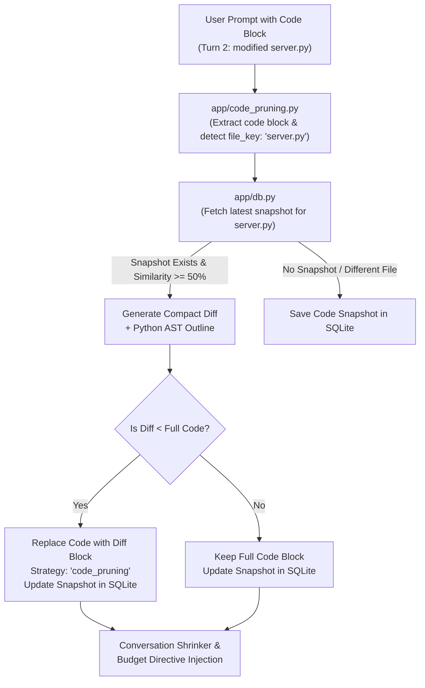

# Phase 8: Coding / AST Diff Pruning

## 1. Executive Summary

Phase 8 introduces specialized token reduction for programming questions, inspired by developer tools like Headroom. When students or developers iterate on code across multiple turns in a session (e.g. asking for modifications to a 35+ line script), re-sending the whole file repeatedly wastes hundreds of tokens on identical boilerplate and unchanged functions.

TokenShield detects repeated code blocks across turns in the same session, extracts a deterministic Python AST outline (classes and functions), generates a compact unified diff using `difflib`, and replaces the redundant code with the diff.

Key capabilities delivered:
1. **Intelligent Code Detection (`app/code_pruning.py`)**: Identifies fenced code blocks and file identifiers from explicit comments (`# filename: server.py`), first lines (`// app.tsx`), or prompt context (`here is my server.py`).
2. **Deterministic AST Outline Extraction**: Uses Python's standard library `ast.walk` to extract classes and functions in sorted order, providing the LLM with structural context without resending the entire body.
3. **Compact Unified Diffing**: Generates line-level unified diffs with minimal context overhead, stripping verbose file headers.
4. **Safety & Zero-Token-Inflation Guarantee**: Diff pruning only triggers when the diff is strictly smaller than the original block and similarity is $\ge 50\%$. Tiny code snippets (< 6 lines or < 120 chars) are preserved untouched.
5. **Full Audit Trail**: Persists `code_snapshots` in SQLite, exposes `x-tokenshield-code-pruned: <n>`, appends `"code_pruning"` to strategies, and tracks `code_pruned` in `/receipt/{request_id}` and `/session/{session_id}/timeline`.

---

## 2. Architecture & Pipeline Flow



---

## 3. Replacement Format

When a student sends a modified version of an existing file in the same session:

### Raw User Input (Turn 2)
````markdown
I updated it:
```python
# filename: server.py
import os
import sys

class ItemManager:
    def __init__(self):
        self.items = []
        self.max_capacity = 100

    def add_item(self, item: str) -> None:
        print(f"Adding item: {item}")
        if len(self.items) >= self.max_capacity:
            raise ValueError("Capacity reached")
        self.items.append(item)
    ... (35 lines)
```
````

### Optimized Upstream Prompt (What the LLM Receives)
````markdown
I updated it:
[Code Update for `server.py` (Diff vs previous turn)]:
AST Outline: Classes: [ItemManager] | Functions: [__init__, add_item, clear, count, list_items, remove_item, run_server]
```diff
@@ -9,2 +9,3 @@
     def add_item(self, item: str) -> None:
+        print(f"Adding item: {item}")
         if len(self.items) >= self.max_capacity:
@@ -34,2 +35,2 @@
 def run_server():
-    print("Starting server on port 8080...")
+    print("Starting server on port 9000...")
```
````

**Token Savings**:
- Raw Code: ~223 tokens.
- Pruned Diff + Outline: ~90 tokens.
- **Immediate Input Token Reduction: ~60% on that turn alone.**

---

## 4. Response Headers & Receipts

### Response Headers
```http
x-tokenshield-strategies: guard_mode,code_pruning,provider_proxy
x-tokenshield-code-pruned: 1
x-tokenshield-saved-input-tokens: 92
```

### Receipt Payload
```json
{
  "request_id": "...",
  "cache": "MISS",
  "strategies": ["guard_mode", "code_pruning", "provider_proxy"],
  "code_pruned": 1,
  "saved_input_tokens": 92
}
```

---

## 5. Verification

Automated tests in [`tests/test_code_pruning.py`](file:///c:/token-shield/tests/test_code_pruning.py):
```powershell
python -m pytest tests/test_code_pruning.py -v
python -m pytest -p no:cacheprovider --basetemp=.tokenshield/pytest_temp -v
```
All 41 tests passing.
