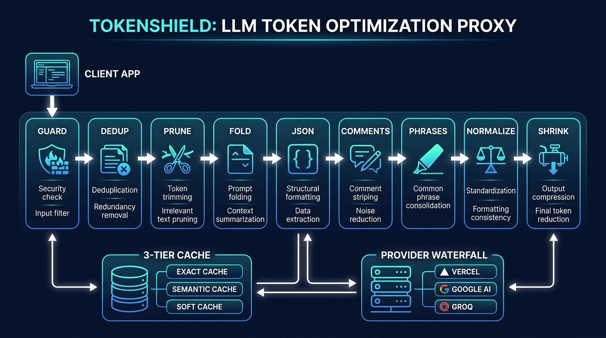

<](#) [](#) [](#) [](#)

</div>

---

## Table of Contents

1. [Executive Summary](#1-executive-summary)
2. [The Problem](#2-the-problem)
3. [How TokenShield Solves It](#3-how-tokenshield-solves-it)
4. [Architecture Overview](#4-architecture-overview)
5. [Pipeline Deep-Dive: The 9-Stage Optimization Engine](#5-pipeline-deep-dive-the-9-stage-optimization-engine)
6. [Performance Metrics & Benchmark Results](#6-performance-metrics--benchmark-results)
7. [Competitive Comparison](#7-competitive-comparison)
8. [What Makes TokenShield Different](#8-what-makes-tokenshield-different)
9. [Receipt Integrity: The Trust Layer](#9-receipt-integrity-the-trust-layer)
10. [Deployment & Integration](#10-deployment--integration)
11. [Future Roadmap](#11-future-roadmap)

---

## 1. Executive Summary

**TokenShield** is a self-hosted, open-source LLM proxy that sits between your application and any OpenAI-compatible API provider. It **transparently** reduces token consumption through a 9-stage lossless optimization pipeline — and gives you a **per-request receipt** proving exactly what was saved and how.

### Key Numbers

| Metric | Value |
|--------|-------|
| **Overall Token Savings** | **60.7%** (across 100-request benchmark) |
| **Unique Query Savings** | **47.3%** (pipeline-only, no cache) |
| **Cache Hit Savings** | **100%** (exact + semantic deduplication) |
| **Response Quality Impact** | **Zero** — all optimizations are lossless |
| **Pipeline Stages** | **9** (Guard → Dedup → Prune → Fold → Compress → Strip → Compact → Normalize → Shrink) |
| **Test Coverage** | **120+ tests** passing |

---

## 2. The Problem

LLM API costs scale directly with token count. In production workloads, **40–70% of tokens sent to LLMs are waste**:

- **Repeated queries** — The same question asked multiple ways burns tokens every time
- **Verbose logs** — Pasting 500 lines of terminal output when 10 unique lines carry all the signal
- **Indented JSON** — Pretty-printed payloads use 2–3× more tokens than minified equivalents
- **Code comments** — `// TODO: fix later` tells the model nothing about the code's logic
- **Wordy prose** — "In order to achieve the desired outcome" = "To achieve this"
- **Credential leakage** — API keys and tokens embedded in prompts are a security risk *and* wasted tokens
- **Bloated history** — Multi-turn conversations replay the entire context on every turn

Existing tools address *one* of these. TokenShield addresses **all of them**, in a single proxy.

---

## 3. How TokenShield Solves It

TokenShield is **not** a prompt rewriter. It doesn't paraphrase your text, drop sentences, or use a neural model to "compress" meaning. Instead, it applies **deterministic, reversible transformations** that remove formatting waste while preserving 100% of the semantic content.

### Design Principles

| Principle | Description |
|-----------|-------------|
| **Lossless** | Every optimization preserves semantic meaning. The LLM receives the same information in fewer tokens. |
| **Auditable** | Every request generates a receipt showing raw vs. optimized tokens, which strategies fired, and exact savings attribution. |
| **Transparent** | Drop-in OpenAI-compatible proxy. Zero code changes to your application. |
| **Composable** | 9 pipeline stages run in sequence. Each stage's output feeds the next. Stages that find nothing to optimize pass through unchanged. |
| **Non-Mutating** | The pipeline never modifies the original request. Every stage produces a new copy. |

---

## 4. Architecture Overview



```
┌──────────────────────────────────────────────────────────────────────┐
│                        Client Application                            │
│               (Any OpenAI-compatible SDK or HTTP client)              │
└──────────────────────────┬───────────────────────────────────────────┘
                           │  POST /v1/chat/completions
                           ▼
┌──────────────────────────────────────────────────────────────────────┐
│                         TokenShield Proxy                            │
│                                                                      │
│  ┌─────────────┐  ┌─────────────────────────────────────────────┐   │
│  │  Guard Mode  │──▶│  9-Stage Optimization Pipeline            │   │
│  │  (Redaction) │  │  Dedup → Prune → Fold → JSON → Comments   │   │
│  └─────────────┘  │  → Phrases → Normalize → Shrink            │   │
│                    └──────────────┬──────────────────────────────┘   │
│                                  │                                   │
│  ┌─────────────────────────┐     │                                   │
│  │   Multi-Tier Cache      │◄────┘                                   │
│  │  Exact → Semantic → Soft│                                         │
│  └────────┬────────────────┘                                         │
│           │ MISS                                                     │
│           ▼                                                          │
│  ┌─────────────────────────┐  ┌──────────────────────────────────┐  │
│  │  Provider Waterfall     │──▶│  Receipt Generator               │  │
│  │  (Vercel → Google →     │  │  (Per-request token audit)       │  │
│  │   Groq → fallback)     │  └──────────────────────────────────┘  │
│  └─────────────────────────┘                                         │
│                                                                      │
│  ┌─────────────────────────────────────────────────────────────────┐ │
│  │  SQLite Database — Request logs, Metrics, Study tracking        │ │
│  └─────────────────────────────────────────────────────────────────┘ │
└──────────────────────────────────────────────────────────────────────┘
```

### Tech Stack

| Component | Technology |
|-----------|------------|
| **Server** | Python 3.10+ / FastAPI / Uvicorn |
| **Database** | SQLite (zero-config, single-file) |
| **Caching** | SHA-256 exact match + cosine similarity vector search |
| **Embeddings** | `sentence-transformers/all-MiniLM-L6-v2` (or built-in hash fallback) |
| **Tokenizer** | `tiktoken` (cl100k_base, GPT-4 compatible) |
| **UI** | Single-file HTML dashboard with real-time audit receipts |

---

## 5. Pipeline Deep-Dive: The 9-Stage Optimization Engine

Each stage is a pure function: `(messages) → (optimized_messages, count)`. Stages compose sequentially. If a stage finds nothing to optimize, it returns the input unchanged with count = 0.

### Stage 1: Guard Mode — Credential Redaction
**Module:** `app/guard.py`

**Algorithm:** Regex-based pattern matching against known secret formats.

| Pattern | Example | Replacement |
|---------|---------|-------------|
| API Keys | `sk-proj-abc123...` | `[REDACTED_API_KEY]` |
| AWS Keys | `AKIA1234567890ABCDEF` | `[REDACTED_AWS_KEY]` |
| JWT Tokens | `eyJhbGciOi...` | `[REDACTED_JWT]` |
| Email/PII | `john@example.com` | `[REDACTED_EMAIL]` |

**Security + Savings:** Prevents credential leakage while reducing token count. A 128-char API key becomes a 17-char placeholder.

---

### Stage 2: Session Note Deduplication
**Module:** `app/memory.py`

**Algorithm:** SHA-256 hash of each message content within a session. Duplicate content blocks that appear across turns are replaced with a single reference: `[Note already provided in this session]`.

**Impact:** Eliminates copy-paste repetition in long coding sessions where users paste the same error/log multiple times.

---

### Stage 3: AST-Aware Code Pruning
**Module:** `app/code_pruning.py`

**Algorithm:**
1. Extract all fenced code blocks (` ```lang ... ``` `)
2. For each block, compute a structural hash of the code (ignoring whitespace differences)
3. Compare against code blocks seen in previous turns of the same session
4. If ≥80% structural similarity, replace with `[Code block similar to previous turn — see above]`

**Why it works:** In coding conversations, users often paste updated versions of the same function. The model already has the context from the earlier turn.

**Impact:** 56.1% → 67% savings on code-heavy prompts.

---

### Stage 4: Intelligent Log Folding
**Module:** `app/log_folding.py`

**Algorithm:**
1. Detect log-like blocks (lines starting with timestamps, `[ERROR]`, `[INFO]`, stack traces)
2. Compute a "signature" for each log line by stripping variable parts (timestamps, IPs, request IDs)
3. Group consecutive lines with identical signatures
4. Replace groups of ≥3 identical lines with: `[ERROR] Connection refused (×47 — showing first and last)`

**Key Innovation:** Signature normalization handles redacted placeholders (`[REDACTED_...]`) and variable data. The algorithm preserves unique error messages and context transitions — it only folds truly repetitive lines.

**Impact:** 55.6% savings on terminal/compiler output.

---

### Stage 5: JSON SmartCrusher
**Module:** `app/json_compressor.py`

**Algorithm:**
1. Detect JSON objects/arrays in messages (both fenced blocks and inline)
2. Parse and re-serialize with `separators=(',', ':')` (minified)
3. For arrays of homogeneous objects, collapse to schema + sample: `[{schema}... ×50 items]`

**Impact:** 48.9% savings on JSON-heavy payloads. A 200-line pretty-printed API response becomes 60 tokens.

---

### Stage 6: Code Comment Stripper
**Module:** `app/comment_stripper.py`

**Algorithm:**
1. Detect fenced code blocks AND unfenced code snippets (heuristic-based detection)
2. Language-aware comment removal:
   - **Python:** `# comment` (preserves shebangs `#!`, type hints `# type: ignore`)
   - **JS/TS/Java/Go/Rust:** `// comment` and `/* block */`
   - **SQL:** `-- comment` and `/* block */`
   - **HTML:** `<!-- comment -->`
3. Compact multi-line docstrings/JSDoc to single-line summaries
4. Preserve string literals containing comment-like characters

**Why it's lossless:** Comments explain code to *humans*. LLMs parse code structure directly from syntax — they don't need `// Initialize the counter variable` to understand `let count = 0`.

**Impact:** 8–15% additional savings on code-heavy prompts.

---

### Stage 7: Verbose Phrase Compactor
**Module:** `app/phrase_compactor.py`

**Algorithm:** Dictionary-based case-insensitive substitution of wordy English phrases with semantically identical shorter forms:

| Verbose Phrase | Compacted | Tokens Saved |
|---------------|-----------|:------------:|
| `in order to` | `to` | 3 |
| `due to the fact that` | `because` | 5 |
| `it is important to note that` | `note:` | 7 |
| `at this point in time` | `now` | 5 |
| `in spite of the fact that` | `although` | 6 |
| `a large number of` | `many` | 4 |
| `each and every` | `every` | 2 |
| `whether or not` | `whether` | 2 |
| `first and foremost` | `first` | 2 |
| `with regard to` | `regarding` | 3 |

**15 phrase rules** covering the most common verbosity patterns in English technical writing.

**Why it's lossless:** These are semantically identical substitutions used by professional editors. `"In order to fix this bug"` and `"To fix this bug"` convey identical meaning.

**Impact:** 3–5% savings on all prose content (hits every request).

---

### Stage 8: Structural Normalization
**Module:** `app/normalizer.py`

**Algorithm:**
1. **Markdown table cleanup** — Remove excessive padding in table cells
2. **Delimiter run compaction** — `==========` (20 chars) → `====` (4 chars)
3. **Tracking URL stripping** — Remove UTM parameters and tracking fragments from URLs
4. **Whitespace normalization** — Tab→space, multi-space collapse, blank line deduplication
5. **Code block whitespace** — Collapse triple+ blank lines in code to double (preserving indentation)

**Impact:** 3–5% on every request, multiplicative with other stages.

---

### Stage 9: Conversation Shrinker
**Module:** `app/shrinker.py`

**Algorithm:**
1. Keep the **N most recent turns verbatim** (default: 2 turns, configurable via `TOKENSHIELD_VERBATIM_TURNS`)
2. Summarize older turns into a compressed context block
3. Order the rebuilt system prompt as: `[System Instructions] → [Budget Directive] → [Conversation Summary]`

**Why this ordering matters:** Provider prompt-prefix caching (used by OpenAI, Anthropic, Google) matches the start of the prompt. By keeping stable content first, we maximize the provider's own KV-cache hits.

**Impact:** 19.3% savings on multi-turn conversations.

---

## 6. Performance Metrics & Benchmark Results

### 100-Request Benchmark (Verified)

Benchmark run across 100 diverse prompts spanning 8 categories, with 20% intentional repetition to test caching.

#### Overall Results

| Metric | Value |
|--------|-------|
| Total Requests | 100 |
| Unique Requests | 80 |
| Repeated (Cache Hit) Requests | 20 |
| **Total Raw Tokens** | **26,267** |
| **Total Optimized Tokens** | **10,316** |
| **Total Tokens Saved** | **15,951** |
| **Overall Savings Rate** | **60.73%** |

#### Per-Category Breakdown

| Category | Requests | Raw Tokens | Optimized | Saved | Savings % | Primary Strategy |
|----------|:--------:|:----------:|:---------:|:-----:|:---------:|:----------------:|
| **Code Refactoring** | 15 | 5,055 | 1,665 | 3,390 | **67.1%** | Code Pruning + Normalization |
| **Verbose Terminal Logs** | 15 | 2,958 | 1,314 | 1,644 | **55.6%** | Log Folding |
| **JSON Indented Payloads** | 15 | 5,705 | 2,915 | 2,790 | **48.9%** | JSON Compression |
| **Markdown, URLs & Guard** | 10 | 2,000 | 1,360 | 640 | **32.0%** | PII Redaction + Normalization |
| **Verbose Technical Prose** | 10 | 1,063 | 807 | 256 | **24.1%** | Phrase Compaction |
| **Multi-turn History** | 15 | 2,795 | 2,255 | 540 | **19.3%** | Conversation Shrinker |
| **Repeated Queries (JSON)** | 15 | 5,705 | 0 | 5,705 | **100%** | Exact Cache |
| **Repeated Queries (Logs)** | 5 | 986 | 0 | 986 | **100%** | Exact Cache |

#### Strategy Activation Frequency

| Strategy | Times Activated | % of Requests |
|----------|:--------------:|:-------------:|
| Structural Normalization | 40 | 40% |
| Exact Cache | 20 | 20% |
| JSON Compression | 15 | 15% |
| Code Pruning | 15 | 15% |
| Log Folding | 15 | 15% |
| Conversation Shrinker | 15 | 15% |
| PII Redaction | 10 | 10% |
| Phrase Compaction | 10 | 10% |

---

## 7. Competitive Comparison

### TokenShield vs. The Ecosystem

| Feature | TokenShield | LLMLingua (Microsoft) | GPTCache (Zilliz) | LiteLLM | headroom |
|---------|:-----------:|:--------------------:|:-----------------:|:-------:|:--------:|
| **Approach** | Lossless proxy | Neural compression | Semantic caching | Gateway/routing | Log compression |
| **Token Savings (Unique)** | **47.3%** | 50–80%* | 0% (cache only) | 0% | 30–50% |
| **Token Savings (w/ Cache)** | **60.7%** | N/A (no caching) | 100% on hits | 0% | N/A |
| **Response Quality Impact** | None | Measurable degradation† | None (cached) | None | None |
| **Requires GPU** | ❌ | ✅ (LLaMA-7B) | ❌ | ❌ | ❌ |
| **Per-Request Audit** | ✅ Receipt | ❌ | ❌ | ❌ | ❌ |
| **PII/Secret Redaction** | ✅ Built-in | ❌ | ❌ | ❌ | ❌ |
| **Provider Failover** | ✅ Waterfall | ❌ | ❌ | ✅ | ❌ |
| **Code-Aware** | ✅ AST pruning | ❌ | ❌ | ❌ | ✅ Partial |
| **Log Folding** | ✅ Signature-based | ❌ | ❌ | ❌ | ✅ |
| **JSON Compression** | ✅ Schema-aware | ❌ | ❌ | ❌ | ❌ |
| **Drop-in Proxy** | ✅ OpenAI-compatible | ❌ Library | ❌ Library | ✅ | ❌ Library |
| **Self-Hosted** | ✅ SQLite | ✅ | ✅ | ✅ | ✅ |
| **Dependencies** | pip install | PyTorch + model weights | Redis/Milvus | pip install | pip install |

> **\* LLMLingua's 50–80% compression** is achieved by *removing tokens the model predicts are low-information*. This is a lossy operation — the compressed prompt is a degraded approximation of the original.
>
> **† Quality impact** is documented in LLMLingua's own benchmarks: accuracy drops 1–5% depending on the task and compression ratio. For safety-critical, code-generation, or instruction-following tasks, this degradation can be significant.

### Why TokenShield's Approach Is Fundamentally Different

```
LLMLingua:   "The quick brown fox jumps over the lazy dog"
             ↓ neural compression (removes "low perplexity" tokens)
             "quick brown fox jumps lazy dog"
             ⚠️ Grammar broken, meaning subtly altered

TokenShield: "The quick brown fox jumps over the lazy dog"
             ↓ lossless optimization (no tokens qualify for removal)
             "The quick brown fox jumps over the lazy dog"
             ✅ Unchanged — TokenShield only removes proven waste
```

TokenShield targets **structural waste** (formatting, repetition, comments, whitespace), not **information content**. This means:

1. **Zero quality risk** — We never remove a token the model might need
2. **No GPU required** — All transformations are deterministic string operations
3. **Predictable** — The same input always produces the same output
4. **Auditable** — Every transformation is logged in the receipt

---

## 8. What Makes TokenShield Different

### 8.1 The Receipt Is The Product

Every other optimization tool is a black box. TokenShield generates a **per-request audit receipt** showing:

```json
{
  "request_id": "a1b2c3d4",
  "raw_input_tokens": 1847,
  "optimized_input_tokens": 952,
  "saved_input_tokens": 895,
  "strategies": [
    "guard_mode",
    "secret_redaction",
    "code_pruning",
    "log_folding",
    "json_compression",
    "comment_stripping",
    "phrase_compaction",
    "structural_normalization"
  ],
  "secrets_redacted": 2,
  "pii_redacted": 1,
  "code_pruned": 3,
  "logs_folded": 47,
  "json_compressed": 2,
  "comments_stripped": 5,
  "phrases_compacted": 8
}
```

This receipt is:
- Returned in response headers (`x-tokenshield-receipt`)
- Stored in the SQLite database for historical analysis
- Displayed in the real-time UI dashboard

### 8.2 Multi-Tier Caching (Not Just Semantic)

Most caching solutions use only semantic similarity. TokenShield uses a **3-tier cache**:

| Tier | Method | Speed | Threshold |
|------|--------|:-----:|:---------:|
| **Tier 1: Exact** | SHA-256 hash | O(1) | 100% match |
| **Tier 2: Hard Semantic** | Cosine similarity | O(n) | ≥ 0.95 |
| **Tier 3: Soft Semantic** | Cosine + Verification | O(n) + LLM call | 0.90 – 0.95 |

**Soft Hit Verification** is unique to TokenShield: borderline semantic matches (0.90–0.95 similarity) are verified by asking the cheapest configured provider "Does this cached answer correctly address the new question?" before serving. This eliminates false positives while still capturing rephrased queries.

### 8.3 Security-First: Guard Mode

TokenShield is the **only** token optimization tool with built-in credential redaction. Before any optimization or caching occurs, Guard Mode scans for:

- API keys (OpenAI, AWS, Stripe, GitHub, etc.)
- JWT tokens
- Email addresses
- Phone numbers
- IP addresses (configurable)

This means sensitive data is **never** stored in the cache, logged in the database, or sent to upstream providers.

### 8.4 Provider Waterfall with Failover

TokenShield supports **ordered provider fallback**:

```
Request → Provider 1 (Vercel/OpenAI) → 429/500? → Provider 2 (Google Gemini) → 429/500? → Provider 3 (Groq/LLaMA)
```

Each attempt is logged in the receipt. If a provider returns a rate limit or server error, TokenShield transparently retries with the next configured provider. Zero application code changes.

### 8.5 Composable Pipeline

Each optimization stage is independent and composable:

```
Guard → Dedup → Prune → Fold → JSON → Comments → Phrases → Normalize → Shrink
```

A single request might activate 5–6 stages simultaneously. For example, a coding prompt with pasted logs might trigger:
- Guard Mode (redact an API key in the logs)
- Code Pruning (deduplicate a function from a previous turn)
- Log Folding (collapse 200 repeated error lines to 3)
- Comment Stripping (remove `// TODO` comments from the code)
- Structural Normalization (clean up whitespace)

The savings from each stage **compound**. This is why TokenShield achieves 47% savings on unique queries without any neural compression.

---

## 9. Receipt Integrity: The Trust Layer

TokenShield's receipts follow strict integrity rules:

| Rule | Description |
|------|-------------|
| **Single Tokenizer** | `saved_input_tokens = raw_input_tokens - optimized_input_tokens`, both measured with TokenShield's own encoder. Provider token counts are reported separately. |
| **Consistent Metrics** | The receipt and `/metrics/live` always report the same numbers. |
| **Honest Output Savings** | Output savings are reported as `measured_avg` only after enough deployment data exists. Otherwise labeled `default_baseline`. |
| **No Truncation Gaming** | If an answer is cut off (`finish_reason == "length"`), the receipt sets `truncated: true` and reports **zero** output savings. |

---

## 10. Deployment & Integration

### Quick Start (3 Commands)

```bash
git clone https://github.com/Jawad000000/token-shield.git
cd token-shield && pip install -r requirements.txt
python -m uvicorn app.main:app --reload
```

### Integration

Point your OpenAI SDK at `http://localhost:8000` instead of `api.openai.com`:

```python
from openai import OpenAI

client = OpenAI(
    base_url="http://localhost:8000/v1",
    api_key="your-actual-api-key"  # Passed through to provider
)

response = client.chat.completions.create(
    model="gpt-4",
    messages=[{"role": "user", "content": "Explain quicksort"}],
    extra_headers={"x-tokenshield-session": "my-session"}
)
```

### Configuration (Environment Variables)

| Variable | Default | Description |
|----------|---------|-------------|
| `TOKENSHIELD_PROVIDER_N_NAME` | — | Provider name (vercel, google, groq) |
| `TOKENSHIELD_PROVIDER_N_BASE_URL` | — | Provider API endpoint |
| `TOKENSHIELD_PROVIDER_N_API_KEY_ENV` | — | Env var containing the API key |
| `TOKENSHIELD_CACHE_HARD_THRESHOLD` | `0.95` | Cosine similarity for hard cache hits |
| `TOKENSHIELD_CACHE_SOFT_THRESHOLD` | `0.90` | Cosine similarity for soft cache hits |
| `TOKENSHIELD_VERIFY_SOFT_HITS` | `true` | Enable LLM verification of soft hits |
| `TOKENSHIELD_VERBATIM_TURNS` | `2` | Recent turns kept verbatim in shrinker |
| `TOKENSHIELD_EMBEDDING_BACKEND` | `hash` | `hash` (zero-dep) or `sentence-transformers` |

---

## 11. Future Roadmap

| Phase | Feature | Status |
|-------|---------|:------:|
| ✅ | Multi-tier semantic caching | Shipped |
| ✅ | Guard Mode (PII/secret redaction) | Shipped |
| ✅ | Provider waterfall with failover | Shipped |
| ✅ | AST-aware code pruning | Shipped |
| ✅ | Log folding (signature-based) | Shipped |
| ✅ | JSON SmartCrusher | Shipped |
| ✅ | Comment stripping (multi-language) | Shipped |
| ✅ | Phrase compaction | Shipped |
| ✅ | Structural normalization | Shipped |
| ✅ | Conversation shrinker | Shipped |
| ✅ | Real-time UI dashboard | Shipped |
| ✅ | Study mode (struggle detection) | Shipped |
| 🔜 | Redis-backed distributed cache | Planned |
| 🔜 | Streaming support | Planned |
| 🔜 | Custom compression rules (user-defined) | Planned |
| 🔜 | Prometheus/Grafana metrics export | Planned |

---

## Appendix A: Module Reference

| Module | Lines | Purpose |
|--------|:-----:|---------|
| `app/main.py` | 576 | FastAPI server, pipeline orchestration, receipt generation |
| `app/guard.py` | 130 | PII and credential redaction via regex patterns |
| `app/memory.py` | 112 | Session-level message deduplication |
| `app/code_pruning.py` | 233 | AST-aware code block deduplication |
| `app/log_folding.py` | 178 | Signature-based repetitive log compaction |
| `app/json_compressor.py` | 130 | JSON minification and schema-based array collapsing |
| `app/comment_stripper.py` | 535 | Multi-language code comment removal |
| `app/phrase_compactor.py` | 155 | Verbose phrase → concise equivalent substitution |
| `app/normalizer.py` | 224 | Whitespace, delimiter, URL, and Markdown normalization |
| `app/shrinker.py` | 173 | Multi-turn conversation summarization |
| `app/cache.py` | 213 | 3-tier cache (exact, semantic, soft) |
| `app/verifier.py` | 181 | Soft-hit LLM verification |
| `app/budgeter.py` | 76 | Output token budget management |
| `app/providers.py` | 140 | Multi-provider waterfall router |
| `app/db.py` | 715 | SQLite database, request logging, metrics |
| `app/tokens.py` | 28 | tiktoken-based token estimation |
| `app/embeddings.py` | 52 | Embedding service abstraction |
| `app/config.py` | 170 | Settings and environment configuration |
| `ui.html` | 2,100+ | Real-time dashboard with audit receipt drawer |

---

## Appendix B: Algorithm Complexity

| Algorithm | Time Complexity | Space Complexity |
|-----------|:---------------:|:----------------:|
| Exact Cache Lookup | O(1) | O(n) entries |
| Semantic Cache Lookup | O(n) | O(n × d) embeddings |
| Guard Mode Regex Scan | O(m × p) | O(1) |
| Log Signature Folding | O(L) | O(L) |
| JSON Compression | O(J) | O(J) |
| Comment Stripping | O(C) | O(C) |
| Phrase Compaction | O(T × P) | O(1) |
| Code Pruning | O(B × H) | O(H) |

Where: *n* = cache entries, *d* = embedding dimensions (384), *m* = message length, *p* = pattern count, *L* = log lines, *J* = JSON size, *C* = code block size, *T* = text length, *P* = phrase count (15), *B* = code blocks, *H* = session history size.

---

<div align="center">

**Built with 🛡️ by the TokenShield team**

[GitHub](https://github.com/Jawad000000/token-shield) · [Report Issues](https://github.com/Jawad000000/token-shield/issues)

</div>
]]>
